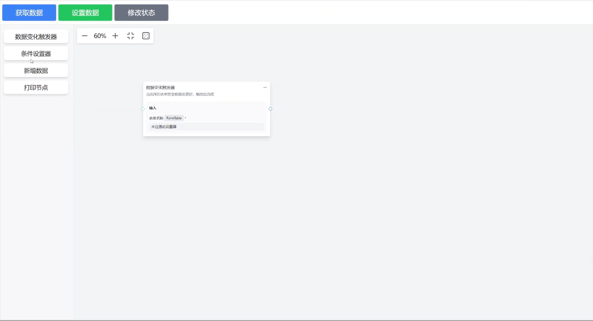

# XFlow Automation 

**XFlow Automation** 是基于 [XFlow](https://github.com/antvis/XFlow) 的扩展项目，参考了comfyui的自动化流程编辑方式，旨在简化自动化流程的开发，提升开发效率

本项目在 WSL:Ubuntu 22.04 下开发，Node.js 版本为 v18.17.0。 如有二次开发有环境问题，可以尝试复刻此开发环境

## 功能特性

在不修改项目UI的基础上，完成自己的自动化流程组件开发，您只需要您只需要

- **注册组件信息** 
- **注册属性设置器**
- **设置流程元数据** 
- **获取并保存流程元数据**

## 视频演示

[](https://github.com/user-attachments/assets/bce4d7d9-27da-4fdf-a8a6-1494c362621d)

## 快速开始

### 环境准备

确保已经安装 Node.js 和 npm。

### 安装

```bash
npm install xflow-automation
```

### 使用

在项目中引入 XFlow Automation

```javascript
import XFlowAutomation from 'xflow-automation';
import 'xflow-automation/dist/style.css'

const App = () => {
  const flowRef = React.useRef();

  // 获取流程图数据
  const getFlowData = () => {
    const flowData = flowRef.current?.getFlowData();
    localStorage.setItem('flowData', JSON.stringify(flowData));
  };

  // 设置流程图数据
  const setFlowData = () => {
    const flowData = JSON.parse(localStorage.getItem('flowData') || '{}');
    flowRef.current?.setFlowData(flowData);
  };

  return <XFlowAutomation ref={flowRef} />;
};

export default App;
```

## 自定义接口

### UI 接口

1. **注册节点属性**
   ```javascript
   registerNodeProps(node :NodeRegistryProps): void;
   ```

2. **注册自定义设置器**
   ```javascript
   registerSetter(setterName: string, setter: React.FC, meta: SetterMeta): void;
   ```
### 数据接口

1. **获取流程数据**
   ```javascript
   getFlowData(): FlowData;
   ```

2. **设置流程数据**
   ```javascript
   setFlowData(flowData: FlowData): void;
   ```


## 许可证

MIT © shitiandmw
